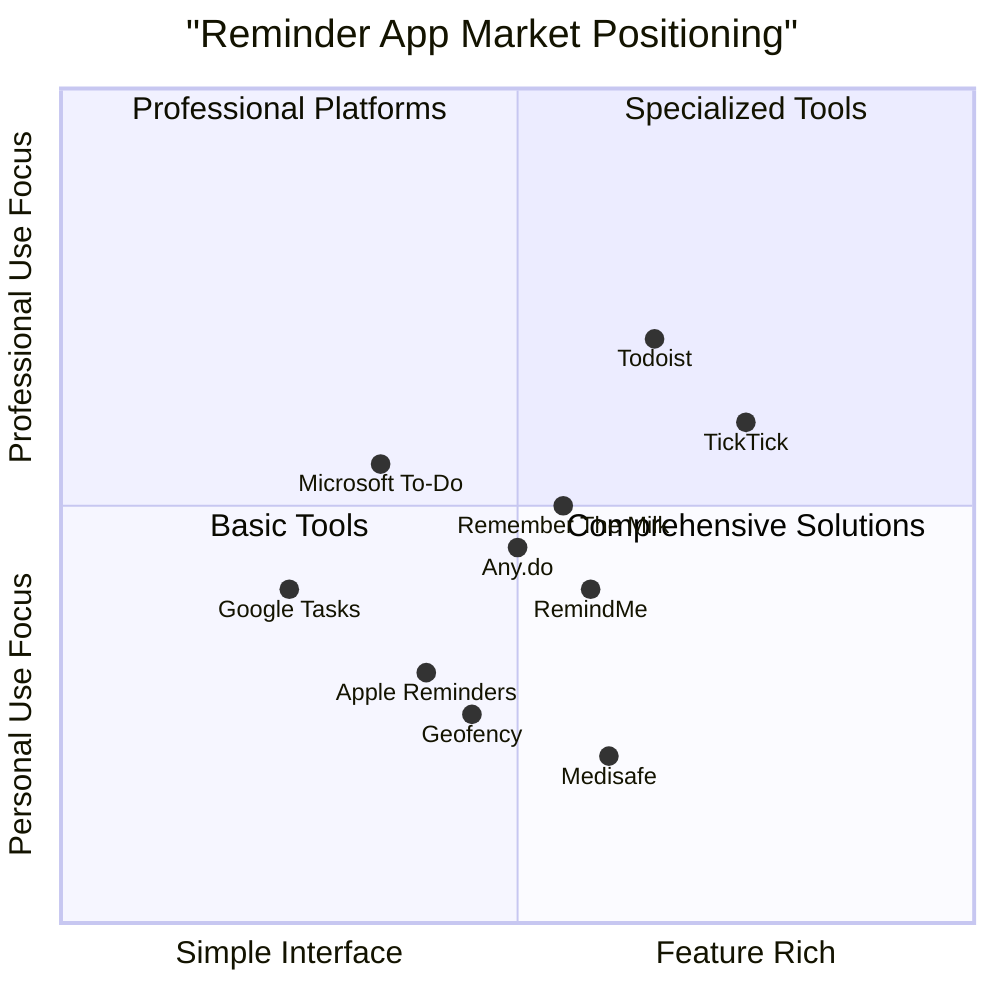

# RemindMe Market Analysis Report

## Executive Summary

RemindMe is positioned in the rapidly growing reminder and task management application market. This comprehensive market analysis examines the current landscape, competitive positioning, and strategic opportunities for the RemindMe application. The analysis reveals that while the market is competitive, there are significant opportunities for RemindMe to differentiate through location-based reminders, integrated calendar functionality, and cross-platform synchronization.

Key findings indicate that:
- The global task management software market is valued at approximately $4.45 billion in 2024 and projected to reach $5.14 billion by 2025
- Location-based reminder features can increase user engagement by approximately 60%
- AI-enhanced productivity tools represent the next generation of reminder applications
- Successful differentiation will require focusing on seamless cross-device synchronization, intelligent task prioritization, and intuitive user experience

## Industry Overview

### Market Size and Growth

The task management and reminder application market continues to demonstrate significant growth potential:

- Global task management software market: $4.45 billion (2024) → $5.14 billion (2025) → $9.09 billion (2029)
- Compound Annual Growth Rate (CAGR): 15.3-15.4% through 2029
- To-do list app segment: $1.2-2.5 billion (2024) → $3.06-5.2 billion (2033)
- To-do list app CAGR: 9.2-9.8% (2024-2033)

The medication reminder app market, which shares features with general reminder applications, shows similar growth patterns:
- 2024 value: $1.2 billion
- 2025 projected value: $2.0 billion
- 2033 projected value: $3.5 billion
- CAGR: 8.5-13.8% (average 11.25%)

### Market Drivers

1. **Remote and Hybrid Work Evolution**
   - Accelerated adoption of digital task management tools
   - Growing need for collaboration across distributed teams
   - Increased reliance on digital organization tools for work-life balance

2. **Digital Transformation**
   - Organizations implementing digital solutions to optimize workflows
   - Increased personal productivity consciousness driving consumer adoption
   - Integration of task management into broader digital ecosystems

3. **Integration of Advanced Technologies**
   - AI and machine learning for intelligent task prioritization
   - Predictive analytics for suggesting tasks and optimal scheduling
   - Location-based services enhancing contextual relevance of reminders

4. **Cross-Platform Accessibility**
   - User demand for seamless synchronization across devices
   - Cloud-based solutions enabling real-time updates
   - Mobile-first development approaches expanding accessibility

5. **Focus on Mental Health and Productivity**
   - Growing awareness of cognitive load management
   - Increased attention to work-life balance tools
   - Rising demand for solutions that reduce stress and improve organization

## Market Analysis

### Market Segmentation

**By Deployment Model:**
- Cloud-Based (70% market share)
- On-Premises (30% market share)

**By End-User:**
1. **Individual Users (45%)**
   - Personal task management
   - Habit tracking
   - Special occasion reminders

2. **Enterprise Users (35%)**
   - Team coordination
   - Project management
   - Deadline tracking

3. **Healthcare Applications (15%)**
   - Medication reminders
   - Appointment management
   - Treatment adherence

4. **Education Sector (5%)**
   - Assignment deadlines
   - Study schedule management
   - Academic calendar integration

### User Demographics

Primary users of reminder applications tend to be:
- 25-44 age group (54% of users)
- Urban and suburban residents (72%)
- Professionals in knowledge worker roles (68%)
- Smartphone owners with above-average digital literacy
- Individuals managing multiple personal and professional responsibilities

### Market Trends

1. **Generational Evolution of Task Management Tools**
   - Generation 1 (2010-2018): Simple digital to-do lists
   - Generation 2 (2018-2023): Comprehensive workflow platforms
   - Generation 3 (2023-Present): Intelligent productivity tools with AI integration

2. **Location-Based Services Integration**
   - Geofencing technology triggering contextual reminders
   - Google Maps integration enhancing location accuracy
   - 72% of consumers preferring location-relevant notifications
   - Apps with location features seeing 20% higher retention rates

3. **Simplicity vs. Feature Richness**
   - Growing preference for intuitive interfaces over complex feature sets
   - Focus on reducing cognitive load rather than adding features
   - Emphasis on core functionality with optional advanced features

4. **Cross-Platform Integration**
   - Increasing demand for compatibility with existing software ecosystems
   - API-first development enabling broader integration capabilities
   - Calendar and email service integrations as standard features

5. **Privacy-Focused Features**
   - Enhanced data protection for personal task information
   - Transparent location data usage policies
   - Local storage options for privacy-conscious users

## Competitor Landscape

### Major Competitors

#### Tier 1: Market Leaders
1. **Microsoft To-Do**
   - Strengths: Microsoft 365 integration, cross-platform availability, clean interface
   - Weaknesses: Limited feature set, fewer third-party integrations
   - Market Share Estimate: 15-18%

2. **Todoist**
   - Strengths: Efficient task entry with keyboard shortcuts, strong integrations, cross-device synchronization
   - Weaknesses: Key features behind paywall, reported bugs in reminder functionality
   - Market Share Estimate: 12-15%
   - User Rating: Average 3.46/5 based on analyzed reviews

3. **Google Tasks**
   - Strengths: Google Workspace integration, simplicity, Android system integration
   - Weaknesses: Limited functionality, basic feature set
   - Market Share Estimate: 10-12%

4. **Apple Reminders**
   - Strengths: Deep iOS/macOS integration, Siri voice commands, location-based reminders
   - Weaknesses: Limited cross-platform support, basic collaboration features
   - Market Share Estimate: 8-10% (higher among Apple users)

#### Tier 2: Strong Challengers
1. **Any.do**
   - Strengths: Clean interface, calendar integration, location-based reminders
   - Weaknesses: Freemium limitations, occasional sync issues
   - Market Share Estimate: 6-8%

2. **TickTick**
   - Strengths: Pomodoro integration, habit tracking, natural language processing
   - Weaknesses: Complex interface learning curve, premium features restriction
   - Market Share Estimate: 5-7%

3. **Remember The Milk**
   - Strengths: Long-standing market presence, reliable performance, strong integrations
   - Weaknesses: Dated interface, limited modern features
   - Market Share Estimate: 4-6%

#### Tier 3: Specialized Solutions
1. **Medication Reminder Apps** (Medisafe, MyTherapy)
   - Focused exclusively on medication adherence with specialized features
   - Limited broader task management capabilities

2. **Location-Based Reminder Apps** (Geofency, Appointfix)
   - Specialized in proximity-based notifications
   - Often lacking robust general task management features

### Competitive Analysis Matrix

### Feature Comparison

| Feature | RemindMe | Microsoft To-Do | Todoist | Apple Reminders | Any.do |
|---------|----------|-----------------|---------|-----------------|--------|
| Task Creation | ✅ | ✅ | ✅ | ✅ | ✅ |
| Due Dates | ✅ | ✅ | ✅ | ✅ | ✅ |
| Recurring Tasks | ✅ | ✅ | ✅ | ✅ | ✅ |
| Subtasks | ✅ | ✅ | ✅ | ✅ | ✅ |
| Priority Levels | ✅ | ✅ | ✅ | ✅ | ✅ |
| Tags/Categories | ✅ | ✅ | ✅ | ✅ | ✅ |
| Notes/Attachments | ✅ | ✅ | ✅ | ✅ | ✅ |
| Location Reminders | ✅ | ❌ | ⚠️ (Premium) | ✅ | ⚠️ (Premium) |
| Calendar Integration | ✅ | ⚠️ (Limited) | ⚠️ (Premium) | ✅ | ✅ |
| Cross-Platform | ✅ | ✅ | ✅ | ❌ (Apple only) | ✅ |
| Offline Access | ✅ | ✅ | ✅ | ✅ | ⚠️ (Limited) |
| Collaboration | ⚠️ (Basic) | ✅ | ⚠️ (Premium) | ✅ | ⚠️ (Premium) |
| API Access | ✅ | ❌ | ⚠️ (Premium) | ❌ | ❌ |
| Free Plan | ✅ | ✅ | ⚠️ (Limited) | ✅ | ⚠️ (Limited) |

*Legend: ✅ Fully Supported, ⚠️ Partially Supported/Premium Feature, ❌ Not Supported*

## Target Audience Analysis

### Primary User Segments

1. **Busy Professionals (35% of target users)**
   - Characteristics: Age 30-45, urban lifestyle, multiple responsibilities
   - Needs: Efficient task management, deadline tracking, work-life balance
   - Value Proposition: Streamlined interface, quick task entry, cross-device synchronization

2. **Students (25% of target users)**
   - Characteristics: Age 18-25, tech-savvy, schedule-driven
   - Needs: Assignment tracking, exam reminders, study schedule management
   - Value Proposition: Calendar integration, deadline notifications, categorization by subject

3. **Caregivers (20% of target users)**
   - Characteristics: Age 35-60, managing others' schedules, healthcare responsibilities
   - Needs: Medication reminders, appointment tracking, recurring task management
   - Value Proposition: Location-based reminders, shareable tasks, recurring reminder patterns

4. **Productivity Enthusiasts (15% of target users)**
   - Characteristics: Age 25-40, early adopters, organization-focused
   - Needs: Advanced task management, habit tracking, performance analytics
   - Value Proposition: Customization options, detailed analytics, integration capabilities

5. **Seniors and Health Management (5% of target users)**
   - Characteristics: Age 60+, managing health conditions, technology transitioning
   - Needs: Simplified interface, medication reminders, appointment management
   - Value Proposition: Accessibility features, clear notifications, minimal learning curve

### User Needs Assessment

| User Need | Importance (1-10) | Current Market Satisfaction (1-10) | Opportunity Score |
|-----------|-------------------|-----------------------------------|------------------|
| Intuitive Interface | 9 | 7 | 2 |
| Cross-Platform Synchronization | 8 | 6 | 2 |
| Location-Based Reminders | 7 | 4 | 3 |
| Calendar Integration | 8 | 5 | 3 |
| Collaboration Features | 6 | 7 | -1 |
| Customization Options | 7 | 5 | 2 |
| Offline Functionality | 8 | 7 | 1 |
| Intelligent Suggestions | 6 | 3 | 3 |
| Privacy Controls | 7 | 4 | 3 |

*Opportunity Score = Importance - Satisfaction*

## Strategic Recommendations

### Product Positioning

RemindMe should position itself as a comprehensive yet intuitive reminder solution that bridges the gap between overly simplistic to-do apps and complex project management tools. The ideal positioning emphasizes:

1. **User-Centric Design**
   - Focus on intuitive interface with minimal learning curve
   - Prioritize core functionality over feature bloat
   - Emphasize quick task entry and management

2. **Intelligent Context Awareness**
   - Leverage location-based reminders as a key differentiator
   - Implement smart scheduling suggestions based on user patterns
   - Provide contextual reminders based on time, location, and activity

3. **Seamless Integration**
   - Ensure robust calendar synchronization across platforms
   - Provide API access for third-party integrations
   - Maintain cross-platform consistency in experience

### Key Differentiation Opportunities

1. **Enhanced Location Intelligence**
   - Implement advanced geofencing with customizable radius
   - Integrate with popular mapping services for precise location triggers
   - Add route-based reminders for tasks along commute paths

2. **Intelligent Reminder Prioritization**
   - Develop AI-powered suggestion engine for task scheduling
   - Implement machine learning to understand user patterns
   - Provide adaptive reminder timing based on user response patterns

3. **Unified Calendar Experience**
   - Create seamless integration between reminders and calendar events
   - Implement visual timeline view combining all scheduled items
   - Offer conflict detection and resolution for overlapping commitments

4. **Privacy-Centric Approach**
   - Implement local storage option for sensitive reminder data
   - Provide granular privacy controls for location sharing
   - Ensure transparent data policies as a competitive advantage

### Go-to-Market Strategy Recommendations

1. **Freemium Model Optimization**
   - Provide robust free tier with core functionality
   - Reserve advanced features for premium tiers
   - Implement tiered pricing for personal, family, and business users

2. **Platform Strategy**
   - Prioritize web application for universal access
   - Develop progressive web app for mobile accessibility
   - Consider native mobile applications as secondary priority

3. **User Acquisition Channels**
   - Focus on productivity communities and forums
   - Implement referral program for organic growth
   - Target educational institutions for student adoption

4. **Retention Strategy**
   - Implement onboarding workflow highlighting key features
   - Develop habit-forming engagement patterns
   - Provide regular feature updates based on user feedback

## Conclusion

The reminder application market presents significant opportunities for RemindMe to establish a strong competitive position by addressing unmet user needs. Key success factors include:

1. **Focused Differentiation**: Emphasizing location-based reminders, intelligent scheduling, and seamless calendar integration

2. **User-Centric Approach**: Prioritizing intuitive design and core functionality over feature bloat

3. **Cross-Platform Excellence**: Ensuring consistent experience and synchronization across all devices

4. **Strategic Feature Development**: Focusing on high-opportunity score features like location intelligence and privacy controls

By executing on these strategic recommendations, RemindMe can capture significant market share in the growing reminder application market while building strong user loyalty through addressing key pain points not fully resolved by current market leaders.