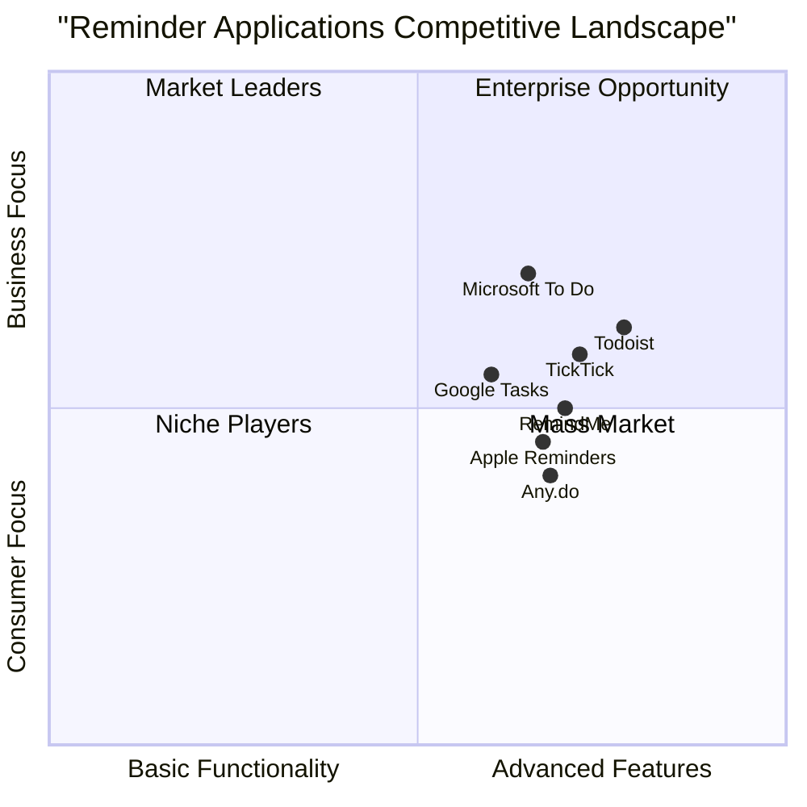

# RemindMe: Product Requirements Document
*Generated on July 08, 2025*

## 1. Introduction

### 1.1 Project Overview
RemindMe is a comprehensive reminder application designed to help users manage their personal and professional tasks with location-based and time-based reminders. The application offers both online functionality through Supabase and offline capabilities via localStorage, ensuring users can access their reminders regardless of their connectivity status.

### 1.2 Project Goals
1. Provide users with an intuitive and reliable platform for creating, managing, and receiving reminders
2. Offer location-based functionality to trigger reminders based on user proximity to specific locations
3. Enable seamless offline and online functionality for consistent user experience across all scenarios

### 1.3 Scope
This PRD outlines the complete requirements for the RemindMe application, including implemented modules and those still to be developed. The application will be web-based with responsive design for mobile devices, offering a comprehensive solution for reminder management.

## 2. User Stories

### 2.1 Core User Scenarios
1. **As a busy professional**, I want to create time-based reminders so that I never miss an important meeting or deadline.
2. **As a forgetful shopper**, I want location-based reminders so that I'm notified of items to purchase when I'm near specific stores.
3. **As a family member**, I want to share reminders with my household so that everyone is aware of important tasks and events.
4. **As a frequent traveler**, I want offline access to my reminders so that I can view and manage them even without internet connectivity.
5. **As a visual planner**, I want calendar and list views of my reminders so that I can visualize my schedule in different formats.

### 2.2. User Persona: Maya, 34, Marketing Manager
Maya juggles multiple projects and client meetings. She needs a reliable reminder system that works across her devices and helps her manage both work and personal obligations. She frequently switches between list and calendar views depending on her planning needs.

### 2.3 User Persona: David, 65, Retiree
David is less tech-savvy but needs help remembering medication schedules and appointments. He prefers a simple interface and values the location-based reminders that alert him when he's near his pharmacy or doctor's office.

## 3. Competitive Analysis

### 3.1 Market Positioning



### 3.2 Competitor Analysis

| Application | Strengths | Weaknesses |
|-------------|-----------|------------|
| Google Tasks | - Deep Google ecosystem integration<br>- Simple, clean interface<br>- Free to use | - Limited functionality<br>- Basic location features<br>- Limited offline capabilities |
| Microsoft To Do | - Microsoft 365 integration<br>- Strong task management<br>- Cross-platform availability | - Complex for simple reminders<br>- Limited location capabilities<br>- Business-focused |
| Apple Reminders | - Deep iOS integration<br>- Siri support<br>- Location-based reminders | - Limited cross-platform support<br>- Basic sharing options<br>- Limited customization |
| Todoist | - Powerful organization tools<br>- Natural language input<br>- Strong cross-platform support | - Premium features require subscription<br>- Steeper learning curve<br>- Limited location intelligence |
| TickTick | - Comprehensive feature set<br>- Calendar integration<br>- Habit tracking | - Complex interface<br>- Premium features require subscription<br>- Overwhelming for casual users |
| Any.do | - Clean, intuitive interface<br>- Smart suggestions<br>- Location-based reminders | - Best features require subscription<br>- Limited offline functionality<br>- Occasional sync issues |

### 3.3 Unique Value Proposition
RemindMe differentiates itself by offering:
1. Seamless offline/online functionality without requiring premium subscriptions
2. Advanced location-based reminders with mapping integration
3. Family sharing capabilities accessible to all users
4. Simple, intuitive interface that balances power and usability
5. Calendar and list views for flexible planning

## 4. Requirements

### 4.1 Functional Requirements

#### 4.1.1 Authentication Module (Implemented)
- **User Registration and Login [P0]**
  - Email/password registration
  - Secure authentication with Supabase
  - Session persistence

- **Account Management [P1]**
  - Password reset functionality
  - Email verification
  - Account deletion

- **Security Enhancements [P2]**
  - Multi-factor authentication
  - Social login options (Google, Facebook)

#### 4.1.2 Dashboard Module (Implemented)
- **Reminder Display [P0]**
  - List view of all reminders
  - Filtering by status (All, Today, Upcoming, Completed)
  - Basic sorting functionality

- **View Management [P0]**
  - Toggle between list and calendar views
  - Responsive design for all device sizes

- **User Interface [P1]**
  - Dark/light mode toggle
  - Custom color themes
  - Accessibility features

#### 4.1.3 Reminder Management Module (Implemented)
- **Reminder Creation [P0]**
  - Title input
  - Date and time selection
  - Optional location attachment
  - Priority setting

- **Reminder Actions [P0]**
  - Mark as complete
  - Delete reminder
  - Edit existing reminders

- **Advanced Management [P1]**
  - Recurring reminders
  - Categorization and tagging
  - Batch operations

#### 4.1.4 Google Maps Integration Module (Partially Implemented)
- **Location Selection [P0]**
  - Address autocomplete
  - Map view for location selection
  - Save favorite locations

- **Location-Based Features [P1]**
  - Geofencing for reminder triggers
  - Route planning from current location
  - Location suggestions based on history

- **Maps Enhancements [P2]**
  - Custom radius for location triggers
  - Multiple location attachment to single reminder
  - Location categories

#### 4.1.5 Onboarding Module (Partially Implemented)
- **User Introduction [P0]**
  - Welcome screens
  - Feature highlights
  - Quick start guide

- **Setup Assistance [P1]**
  - Permission request guidance (notifications, location)
  - Sample reminder creation
  - Preference configuration

- **User Retention [P2]**
  - Personalized tips based on usage
  - Feature discovery prompts
  - Usage tutorials

#### 4.1.6 Calendar Integration Module (Not Implemented)
- **Calendar View [P0]**
  - Monthly calendar display
  - Daily reminder highlights
  - Date selection and filtering

- **External Calendar Sync [P1]**
  - Google Calendar integration
  - iCalendar support
  - Two-way synchronization

- **Advanced Calendar Features [P2]**
  - Week and agenda views
  - Drag-and-drop rescheduling
  - Calendar sharing

#### 4.1.7 Notification Module (Not Implemented)
- **Basic Notifications [P0]**
  - Browser notifications
  - Time-based alerts
  - Location-based alerts

- **Notification Management [P1]**
  - Customizable notification sounds
  - Snooze functionality
  - Batch notification settings

- **Advanced Alerting [P2]**
  - Push notifications on mobile
  - Email notifications for critical reminders
  - SMS notifications (premium feature)

#### 4.1.8 Family Sharing Module (Not Implemented)
- **Basic Sharing [P0]**
  - Share individual reminders
  - Accept/reject shared reminders
  - View shared reminders in personal dashboard

- **Group Management [P1]**
  - Create family/team groups
  - Group permission settings
  - Group calendar view

- **Collaborative Features [P2]**
  - Real-time updates on shared reminders
  - Comments and discussion on reminders
  - Responsibility assignment

#### 4.1.9 Error Handling Module (Not Implemented)
- **User Feedback [P0]**
  - Friendly error messages
  - Offline mode indicators
  - Sync status information

- **Error Recovery [P1]**
  - Auto-retry mechanisms
  - Data recovery options
  - Conflict resolution for shared reminders

- **Logging and Reporting [P2]**
  - User-initiated bug reports
  - Anonymous usage statistics
  - Crash analytics

#### 4.1.10 Security Module (Not Implemented)
- **Data Protection [P0]**
  - Encryption of sensitive information
  - Privacy controls for shared data
  - Session timeout settings

- **Access Control [P1]**
  - Granular permission settings
  - Device management
  - Login attempt limitations

- **Advanced Security [P2]**
  - Biometric authentication options
  - Data export and portability
  - Account recovery options

### 4.2 Non-Functional Requirements

#### 4.2.1 Performance
- **Responsiveness [P0]**
  - App load time < 2 seconds on broadband connections
  - Reminder creation < 1 second
  - UI interactions < 100ms response time

- **Scalability [P1]**
  - Support for up to 1,000 reminders per user
  - Up to 10 concurrent users per shared reminder
  - Up to 5 active devices per user account

#### 4.2.2 Reliability
- **Offline Functionality [P0]**
  - 100% functionality without internet connection
  - Automatic synchronization when connection is restored
  - No data loss during offline-online transitions

- **Data Integrity [P1]**
  - Automated backups for user data
  - Conflict resolution for simultaneous edits
  - Data validation before storage

#### 4.2.3 Usability
- **Accessibility [P0]**
  - WCAG 2.1 AA compliance
  - Screen reader compatibility
  - Keyboard navigation support

- **User Experience [P1]**
  - Consistent design language
  - Responsive layout for all screen sizes
  - Intuitive information architecture

#### 4.2.4 Security
- **Data Protection [P0]**
  - Encryption for all stored and transmitted data
  - Secure authentication practices
  - Regular security audits

- **Privacy [P1]**
  - Compliance with GDPR and CCPA regulations
  - Transparent data usage policies
  - Minimal required permissions

## 5. Technical Architecture

### 5.1 Frontend
- React framework with functional components
- Tailwind CSS for styling
- React Router for navigation
- Context API for state management

### 5.2 Backend Options
- **Supabase Integration**
  - Authentication services
  - PostgreSQL database
  - Real-time data synchronization
  - Storage for user data

- **LocalStorage Fallback**
  - Client-side data persistence
  - Offline functionality
  - Data synchronization when online
  - Consistent API with Supabase integration

### 5.3 External Integrations
- Google Maps API for location services
- Calendar APIs (Google, Apple) for synchronization
- Push notification services for alerts

## 6. UI Design Draft

### 6.1 Dashboard View
```
┌─────────────────────────────────────────────────────┐
│ ◀️ RemindMe                          👤 Profile     │
├─────────────────────────────────────────────────────┤
│                                                     │
│  [List View] [Calendar View]        [+ New Reminder]│
│                                                     │
│  ┌─────────────────────────────────────────────┐    │
│  │ Filter: [All] [Today] [Upcoming] [Completed]│    │
│  └─────────────────────────────────────────────┘    │
│                                                     │
│  ┌─────────────────────────────────────────────┐    │
│  │ Meeting with Client                         │    │
│  │ 📅 Jul 10, 2025 - 3:00 PM                   │    │
│  │ 📍 Downtown Office                          │    │
│  │                           [Complete][Delete]│    │
│  └─────────────────────────────────────────────┘    │
│                                                     │
│  ┌─────────────────────────────────────────────┐    │
│  │ Pick up groceries                           │    │
│  │ 📅 Jul 8, 2025 - 6:00 PM                    │    │
│  │ 📍 Whole Foods Market                       │    │
│  │                           [Complete][Delete]│    │
│  └─────────────────────────────────────────────┘    │
│                                                     │
└─────────────────────────────────────────────────────┘
```

### 6.2 Calendar View
```
┌─────────────────────────────────────────────────────┐
│ ◀️ RemindMe                          👤 Profile     │
├─────────────────────────────────────────────────────┤
│                                                     │
│  [List View] [Calendar View]        [+ New Reminder]│
│                                                     │
│  ┌─────────────────────────────────────────────┐    │
│  │         ◀️ July 2025 ▶️                    │    │
│  │                                             │    │
│  │  Sun Mon Tue Wed Thu Fri Sat                │    │
│  │   30  1   2   3   4   5   6                 │    │
│  │   7   8   9   10  11  12  13                │    │
│  │   14  15  16  17  18  19  20                │    │
│  │   21  22  23  24  25  26  27                │    │
│  │   28  29  30  31  1   2   3                 │    │
│  └─────────────────────────────────────────────┘    │
│                                                     │
│  Selected: July 8, 2025                             │
│                                                     │
│  ┌─────────────────────────────────────────────┐    │
│  │ Pick up groceries - 6:00 PM                 │    │
│  │ 📍 Whole Foods Market                       │    │
│  └─────────────────────────────────────────────┘    │
│                                                     │
└─────────────────────────────────────────────────────┘
```

### 6.3 New Reminder Form
```
┌─────────────────────────────────────────────────────┐
│ ◀️ RemindMe                          👤 Profile     │
├─────────────────────────────────────────────────────┤
│                                                     │
│  + New Reminder                                     │
│                                                     │
│  What do you want to be reminded about?             │
│  ┌─────────────────────────────────────────────┐    │
│  │ [Pick up dry cleaning                      ]│    │
│  └─────────────────────────────────────────────┘    │
│                                                     │
│  When should we remind you?                         │
│  ┌─────────────────────┐ ┌─────────────────────┐    │
│  │ [07/15/2025       ] │ │ [4:30 PM          ] │    │
│  └─────────────────────┘ └─────────────────────┘    │
│                                                     │
│  Where? (Optional)                                  │
│  ┌─────────────────────────────────────────────┐    │
│  │ [123 Main Street - Cleaners               ]│    │
│  └─────────────────────────────────────────────┘    │
│                                                     │
│  [        Create Reminder        ]                  │
│                                                     │
└─────────────────────────────────────────────────────┘
```

## 7. Implementation Roadmap

### 7.1 Phase 1: Core Functionality (Weeks 1-3)
- Complete LocalStorage fallback implementation
- Implement basic Calendar Integration Module
- Develop Notification system for time-based reminders
- Complete Google Maps integration for location-based reminders

### 7.2 Phase 2: Enhanced Features (Weeks 4-6)
- Implement Family Sharing functionality
- Develop comprehensive error handling system
- Complete onboarding experience
- Add basic security features

### 7.3 Phase 3: Advanced Features (Weeks 7-9)
- Implement advanced security with multi-factor authentication
- Add external calendar synchronization
- Develop advanced notification options
- Optimize for mobile devices
- Comprehensive testing and bug fixing

## 8. Open Questions

1. **Security Implementation**: How should we approach the implementation of multi-factor authentication? Should we use SMS, email, or authenticator apps?

2. **Notification Strategy**: What is the best approach for implementing cross-platform notifications that work reliably on both desktop and mobile browsers?

3. **Family Sharing Model**: What permission model should we use for shared reminders? Should all members have equal editing rights?

4. **Offline Synchronization**: How should we handle conflict resolution when multiple users modify shared reminders while offline?

5. **Location Privacy**: How can we implement location-based reminders while minimizing privacy concerns and battery consumption?

## 9. Success Metrics

### 9.1 User Engagement
- Daily Active Users (DAU) / Monthly Active Users (MAU) ratio > 40%
- Average of 5+ reminders created per user per week
- 70% of users return within 3 days of first use

### 9.2 Feature Adoption
- 50% of users create at least one location-based reminder
- 30% of users utilize calendar view regularly
- 20% of users share reminders with family/friends

### 9.3 Performance & Reliability
- App crash rate < 1%
- Successful synchronization rate > 99%
- Average app load time < 2 seconds

### 9.4 User Satisfaction
- In-app satisfaction score > 4.5/5
- App store rating > 4.3/5
- Support ticket rate < 1 per 100 users per month

## 10. Conclusion

The RemindMe application addresses a clear market need for a versatile, reliable reminder system that works across different contexts and connectivity states. With its unique combination of time-based and location-based reminders, family sharing capabilities, and offline functionality, RemindMe offers significant value to users managing busy lives.

This PRD outlines both the implemented modules and the development roadmap for completing the full application vision. By following this plan, the development team will deliver a cohesive, feature-rich application that competes effectively in the reminder and task management market.